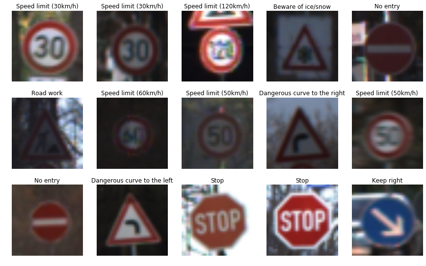
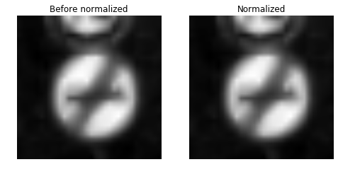
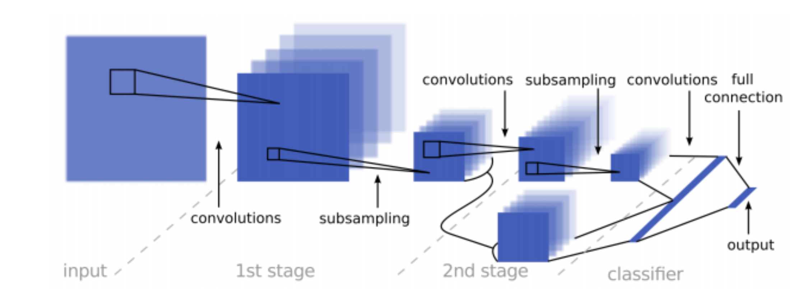
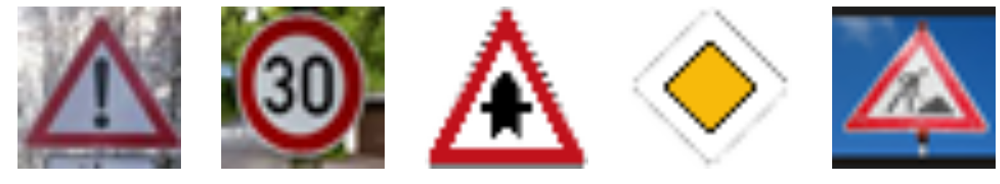
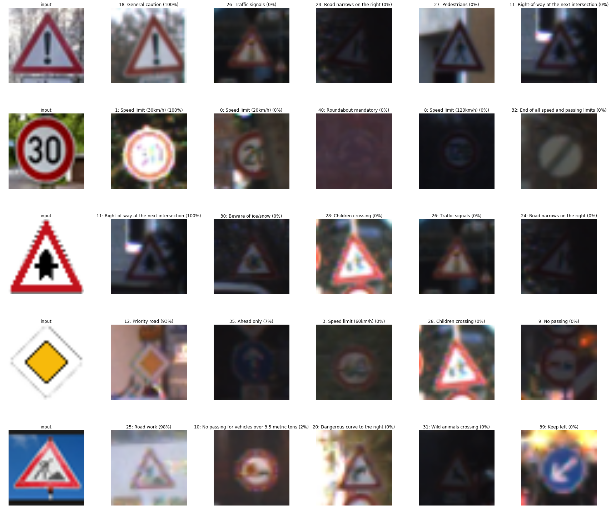

**Traffic Sign Recognition** 

---

**Build a Traffic Sign Recognition Project**

The goals / steps of this project are the following:
* Load the data set (see below for links to the project data set)
* Explore, summarize and visualize the data set
* Design, train and test a model architecture
* Use the model to make predictions on new images
* Analyze the softmax probabilities of the new images
* Summarize the results with a written report

---
## Rubric Points

**Dataset Exploration**

In this section, I modified the LeNet lab code to print out the summary of the dataset we have for the traffic classifier. Just used python function. All the images we have are all 32x32 in size and with RGB 3 Channels. 
* Number of training examples = 34799
* Number of validation examples = 4410
* Number of testing examples = 12630
* Image data shape = (32, 32, 3)
* Number of classes = 43

**Dataset Visualization**

I used Matplotlib library to print out random 15 images. To make the data more readable, I also added the sign name to the image based on the csv file. Here's what they look like.

In order to explore the distribution of samples across all labels. I sorted the each label by the number of samples in desc order. We can see from the image that. The difference of the sample numbers between labels are pretty significant. This can be a factor that may impact our training result.
![alt text][(./images/sample_distribution.png)

---
## Design and Test a Model Architecture

**Preprocessing**

There are two steps in my data preprocessing:
* Convert the image to grayscale: This step reduced the train dataset from 3 channels to 1 channel, which can significantly reduce the training time. More over, all traffic signs are unique in shape, so color doesn't really matter in our case. Here's the images before and after conversion:

* Normalize the data: Just as Vincent mentioned in his lecture, normalized data works better with optimizer. As it suggests in the project instruction,  I used (x - 128) / 128 to keep the data range in [-1, 1]. The first few training actually give me better results without normalization for unkown reason. If I were given more time, I'd like to research this topic, which can may possibly improve my classifier. Images before and after normalization:

**Model Architecture**

Because I convert the training data to grayscale, which as only one channel, nothing needs to be changed from the LeNet lab we did in the lecture. All the details are provided and explained. After reading the article provided in the instruction, I decided to try the new model. Here's the visual structure of both networks side by side.

#### Origianl LeNet

#### Modified LeNet

Just as the article said, this model works better in our use case. My validation accuracy boosted from 88% to 95%, testing accuracy also increased to 94%. The stucture of the modified neural network consisted of the following layers:

| Layer         		|     Description	        					| Input |Output| 
|:---------------------:|:---------------------------------------------:| :----:|:-----:|
| Convolution 5x5     	| 1x1 stride, valid padding, RELU activation 	|**32x32x1**|28x28x6|
| Max pooling			| 2x2 stride, 2x2 window						|28x28x6|14x14x6|
| Convolution 5x5 	    | 1x1 stride, valid padding, RELU activation 	|14x14x6|10x10x16|
| Max pooling			| 2x2 stride, 2x2 window	   					|10x10x16|5x5x16|
| Convolution 5x5 		| 1x1 stride, valid padding, RELU activation    |5x5x16|1x1x400|
| Flatten from last Convoluation				| 3 dimensions -> 1 dimension					|1x1x400| 800|
| Flatten from last Max pooling				| 3 dimensions -> 1 dimension					|5x5x16| 400|
| Concatenate | connect flattened layers to 1 layer with size 800			|400+400|800|
| Dropout | Randomly drop out data in each batch with the probability set in keep_prob			|800|800|
| Fully Connected | output = number of traffic signs in data set	|800|**43**|

**Model Training**

I lauched a GPU enabled EC2 instance in AWS to train my model. The cost is $0.65/hour, but it is much faster than my Mac. I used AdamOptimizer as suggested in the LeNet lab with all my final parameters for training:
* batch size: 120
* epochs: 60
* learning rate: 0.0009
* mu: 0
* sigma: 0.1
* dropout keep probability: 0.5

The result:
* Validation Accuracy: 0.951
* Testing Accuracy: 0.942

**Solution Approach**

There are mutiple stages while I find the solution:
* Kept the model from LeNet lab, the result is rather disappointing, only around 88%. 
* Implemented the modified model in the article. The result is around 92%
* Tweak the dropout rate to deal with overfitting. Change epochs and batch_size. Lower learning rate with higher epochs tend to give better results. The final result meets the requirement.

## Test a Model on New Images

**Acquiring New Images**

I downloaded 5 images from google with different sizes. I chose some unfamiliar signs just to test out. I didn't choose special images like signs covered with snow and shot from strange angles because I don't expect them to work based on our training data. Given more time, I would want to test darker images.

**Performance on New Images**

The accuracy of the prediction on these 5 images are **100%**. It's much higher than the test set. Multiple reasons for this result:
* The images I managed to find on Google are relatively brighter and were shot at almost right angle. 
* The test set has much more images than the 5 images I chose. It covers more test cases.

Based on the result, the model would work pretty well under normal conditions in real-world. But I doubt it can perform well enough in harsh weather conditions like snow, heavy rain, broken head lights, etc. More testing is needed.

**Model Certainty - Softmax Probabilities**

My classifier is very confident with its predition. Most of them are 100% for the first guess. The last two predictions respectively have 7% and 2% for the second guess. I printed out the the images and its certainty attached. The format is **predicted-value: label-name (certainty)**

## Thanks for the review!
